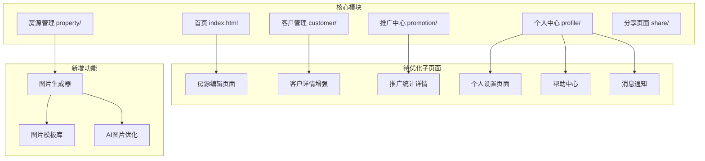
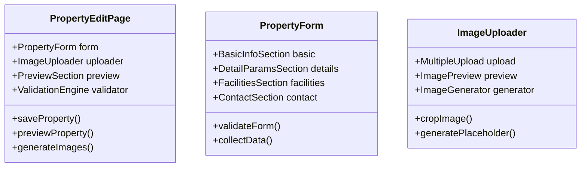
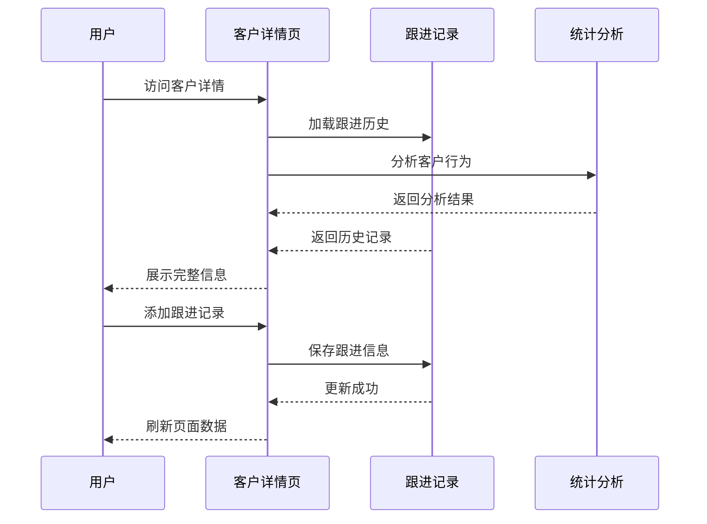
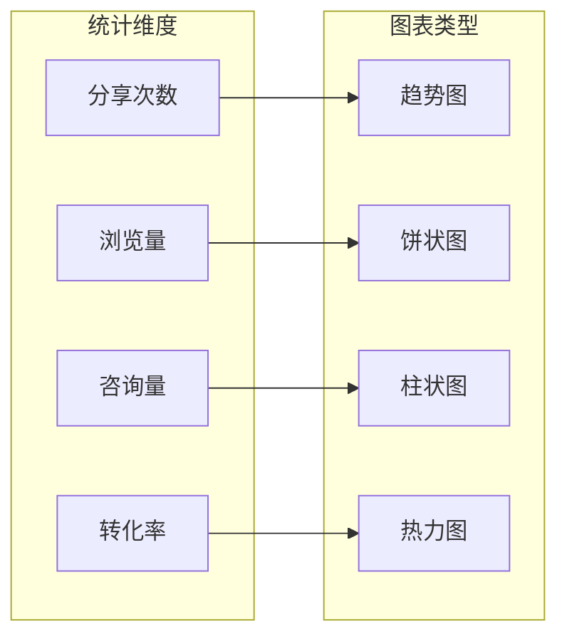
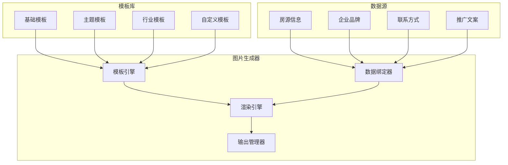
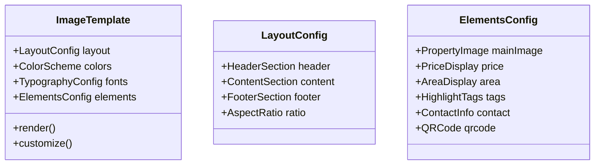
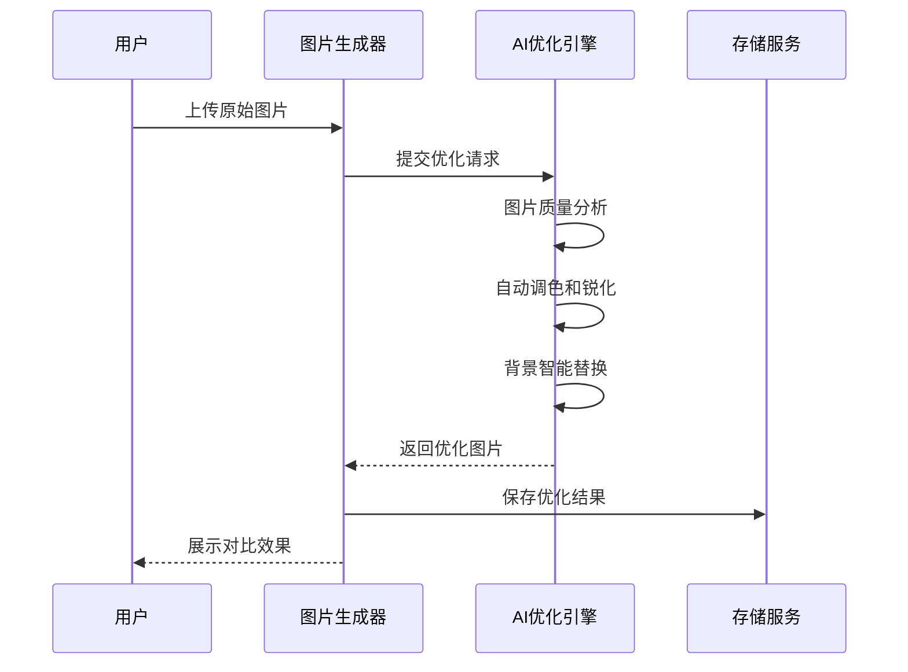
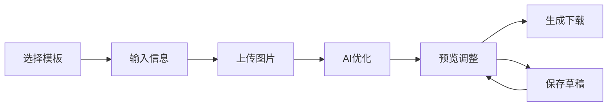
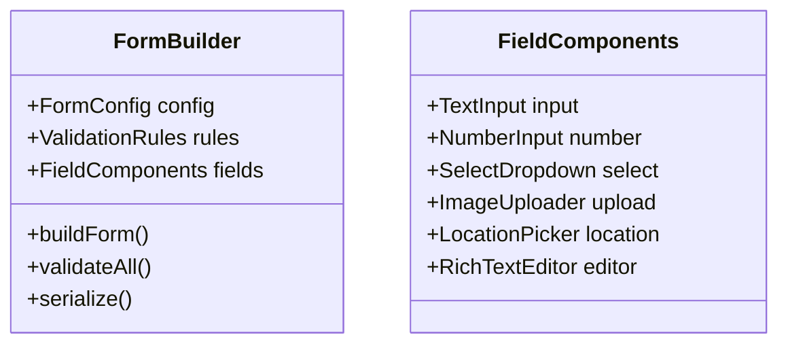
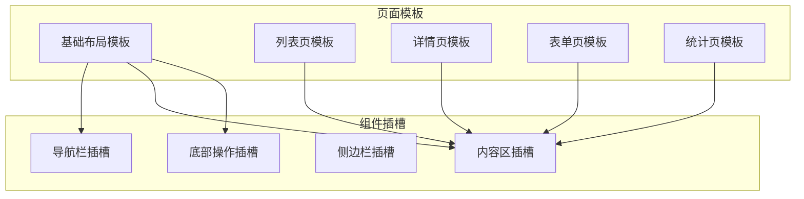

# 其他子页面优化与房源图片生成功能设计

## 1. 概述

本设计文档旨在完善工业地产SCRM系统中的其他子页面功能，并集成房源图片生成能力，提升用户体验和系统完整性。

## 2. 技术架构

### 2.1 前端技术栈
- **核心技术**: HTML5, CSS3, ES6+ JavaScript
- **图标库**: Font Awesome 6.0
- **样式系统**: CSS变量 + BEM命名规范
- **响应式**: 移动优先设计（320px-1920px）

### 2.2 页面模块架构

## 3. 子页面功能设计

### 3.1 房源编辑页面优化

#### 3.1.1 页面结构

#### 3.1.2 核心功能
- **智能表单**: 分步式表单填写，实时验证
- **图片管理**: 支持批量上传、拖拽排序、在线编辑
- **预览模式**: 实时预览房源详情页效果
- **自动保存**: 防止数据丢失的草稿功能

### 3.2 客户详情增强

#### 3.2.1 交互流程

#### 3.2.2 功能模块
- **客户画像**: 行为分析、偏好标签、成交概率
- **跟进时间轴**: 可视化跟进历史，支持图片、语音备注
- **智能提醒**: 基于客户状态的跟进提醒
- **关联房源**: 客户浏览/咨询的房源记录

### 3.3 推广统计详情页

#### 3.3.1 数据可视化

#### 3.3.2 核心指标
- **传播效果**: 分享路径追踪、二次传播分析
- **用户行为**: 页面停留时间、点击热点分析
- **转化漏斗**: 从分享到咨询到成交的完整链路
- **佣金统计**: 推广收益明细和排行榜

### 3.4 个人中心子页面

#### 3.4.1 设置页面
- **账户设置**: 头像、昵称、联系方式管理
- **隐私设置**: 信息可见性、推送通知设置
- **工作设置**: 工作区域、专业领域配置
- **系统设置**: 主题切换、语言选择

#### 3.4.2 帮助中心
- **常见问题**: 分类FAQ，支持搜索
- **使用教程**: 图文教程和视频指导
- **意见反馈**: 问题上报和建议提交
- **联系客服**: 在线客服和电话支持

#### 3.4.3 消息通知页面
- **系统通知**: 版本更新、功能公告
- **业务通知**: 客户动态、房源更新
- **推广通知**: 佣金到账、分享反馈
- **个人消息**: 私信、@提醒

## 4. 房源图片生成系统

### 4.1 图片生成架构

### 4.2 模板系统设计

#### 4.2.1 模板分类
| 模板类型 | 应用场景 | 特点 |
|---------|---------|------|
| 基础模板 | 常规房源展示 | 简洁清晰，突出关键信息 |
| 营销模板 | 推广分享 | 视觉冲击力强，促销元素丰富 |
| 专业模板 | 工业地产 | 突出技术参数和配套设施 |
| 品牌模板 | 企业宣传 | 统一品牌视觉，增强识别度 |

#### 4.2.2 模板元素

### 4.3 AI图片优化功能

#### 4.3.1 智能优化流程

#### 4.3.2 优化算法
- **画质增强**: 基于深度学习的超分辨率算法
- **自动调色**: 智能色彩平衡和饱和度优化
- **背景处理**: 自动抠图和背景替换
- **构图优化**: 智能裁剪和构图建议

### 4.4 图片生成器界面设计

#### 4.4.1 操作流程

#### 4.4.2 界面布局
- **左侧面板**: 模板选择、参数配置
- **中央画布**: 实时预览和编辑
- **右侧工具**: 图层管理、样式调整
- **底部操作**: 撤销重做、保存导出

## 5. 组件复用与扩展

### 5.1 通用组件库

#### 5.1.1 表单组件增强

#### 5.1.2 数据展示组件
- **统计卡片**: 支持动画效果的数据展示
- **趋势图表**: 基于Canvas的轻量级图表
- **数据表格**: 支持排序、筛选、分页
- **时间轴**: 可交互的事件时间轴

### 5.2 页面模板系统

#### 5.2.1 模板结构

## 6. 性能优化策略

### 6.1 图片处理优化
- **延迟加载**: 可视区域外图片延迟加载
- **格式优化**: WebP格式支持，降级到JPEG
- **尺寸适配**: 根据设备像素密度提供不同尺寸
- **缓存策略**: 本地存储和CDN缓存结合

### 6.2 页面加载优化
- **代码分割**: 按模块拆分JavaScript代码
- **预加载**: 关键资源预加载和预连接
- **服务端渲染**: 关键页面SSR优化首屏速度
- **离线缓存**: Service Worker实现离线访问

## 7. 用户体验优化

### 7.1 交互体验
- **加载状态**: 骨架屏和进度指示器
- **操作反馈**: 及时的成功/错误提示
- **手势支持**: 移动端手势操作
- **键盘导航**: 完整的键盘访问支持

### 7.2 视觉设计
- **设计系统**: 统一的颜色、字体、间距规范
- **动画效果**: 微交互动画提升体验
- **深色模式**: 支持系统主题切换
- **无障碍设计**: WCAG 2.1 AA级别兼容

## 8. 测试策略

### 8.1 功能测试
- **单元测试**: 组件和工具函数测试
- **集成测试**: 页面间交互流程测试
- **端到端测试**: 完整业务流程自动化测试
- **兼容性测试**: 主流浏览器和设备兼容性

### 8.2 性能测试
- **页面性能**: Core Web Vitals指标监控
- **图片生成**: 生成速度和质量评估
- **内存使用**: 内存泄漏检测和优化
- **网络性能**: 弱网环境下的表现测试