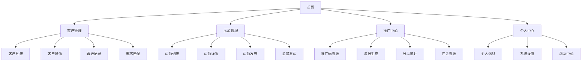
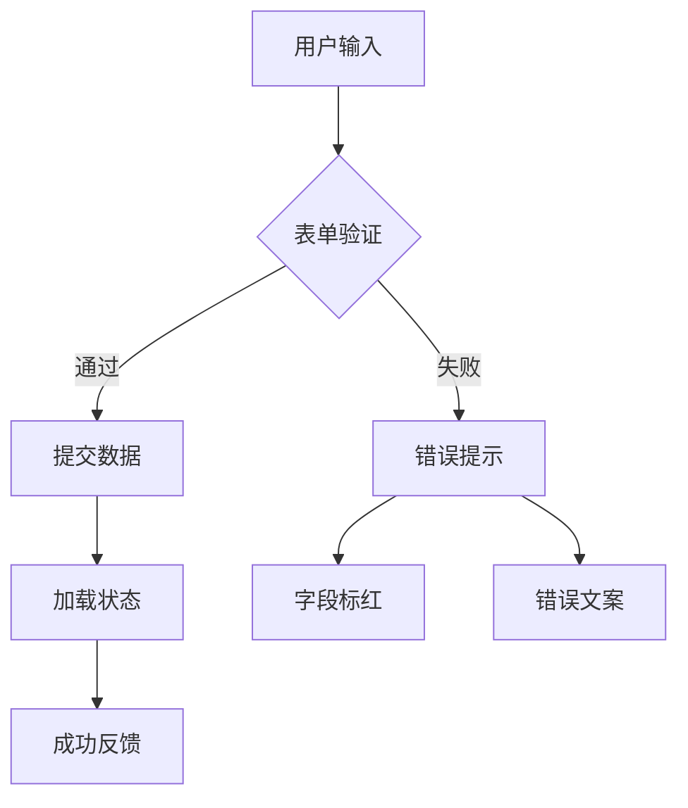
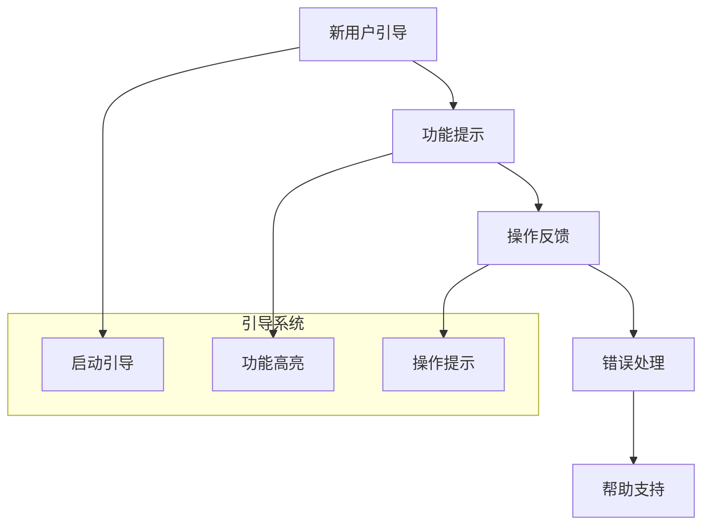

# 工业地产SCRM系统原型页面设计

## 1. 设计概述

### 1.1 设计目标
基于工业地产SCRM系统的业务需求，设计一套完整的用户界面原型，涵盖客户管理、房源管理、营销推广等核心功能模块的页面交互设计。

### 1.2 设计原则
- **简洁高效**：界面简洁明了，操作流程高效
- **移动优先**：针对微信小程序和移动端H5优化
- **数据驱动**：突出关键业务数据和指标
- **社交化**：支持便捷的分享和推广功能

### 1.3 平台适配
- 微信小程序（主要平台）
- H5移动端页面（推广分享）
- PC后台管理系统（运营管理）

## 2. 整体信息架构

### 2.1 页面导航结构



### 2.2 用户角色页面权限

| 页面模块 | 普通销售 | 销售经理 | 推广合伙人 | 管理员 |
|---------|---------|---------|-----------|-------|
| 客户管理 | ✓ | ✓ | ✗ | ✓ |
| 房源管理 | ✓ | ✓ | 浏览 | ✓ |
| 推广中心 | ✓ | ✓ | ✓ | ✓ |
| 数据统计 | 个人 | 团队 | 个人 | 全部 |

## 3. 核心页面设计

### 3.1 首页设计

#### 3.1.1 页面布局

```
+---------------------------+
|     顶部导航栏              |
| [Logo]        [通知][用户] |
+---------------------------+
|        数据概览卡片          |
| +-----+ +-----+ +-----+   |
| |今日 | |本周 | |本月 |   |
| |客户 | |跟进 | |成交 |   |
| | 5  | | 23 | | 8  |   |
| +-----+ +-----+ +-----+   |
+---------------------------+
|        快捷功能入口          |
| +----------+ +----------+  |
| |添加客户   | |发布房源   |  |
| +----------+ +----------+  |
| +----------+ +----------+  |
| |生成海报   | |推广统计   |  |
| +----------+ +----------+  |
+---------------------------+
|        最近动态列表          |
| • 张三预约看房 2小时前        |
| • 李四咨询厂房 3小时前        |
| • 王五成交确认 1天前         |
+---------------------------+
|       底部导航栏             |
| [首页][客户][房源][推广][我的]|
+---------------------------+
```

#### 3.1.2 关键交互设计

| 元素 | 交互行为 | 跳转页面 |
|------|---------|---------|
| 数据卡片 | 点击查看详细统计 | 对应数据统计页 |
| 添加客户 | 快捷录入客户信息 | 客户创建页 |
| 发布房源 | 快捷发布房源 | 房源发布页 |
| 生成海报 | 选择房源生成推广海报 | 海报生成页 |
| 动态条目 | 点击查看详情 | 具体记录详情页 |

### 3.2 客户管理模块

#### 3.2.1 客户列表页

```
+---------------------------+
|    搜索栏 + 筛选按钮         |
| [🔍输入客户名称...] [筛选⚙️] |
+---------------------------+
|        筛选标签栏           |
| [全部] [意向] [带看] [成交]  |
+---------------------------+
|       客户卡片列表          |
| +------------------------+ |
| | 🏢 深圳XX科技公司        | |
| | 👤 张经理  📞 138****   | |
| | 💰 500-800万 📏 2000㎡ | |
| | 🏷️ 初步意向 ⏰ 2天前    | |
| | [📞电话] [👁️详情] [✏️跟进] | |
| +------------------------+ |
| +------------------------+ |
| | 🏢 广州YY制造有限公司     | |
| | 👤 李总   📞 139****    | |
| | 💰 300-500万 📏 1500㎡  | |
| | 🏷️ 带看中  ⏰ 1天前     | |
| | [📞电话] [👁️详情] [✏️跟进] | |
| +------------------------+ |
+---------------------------+
|      [+ 添加客户]           |
+---------------------------+
```

#### 3.2.2 客户详情页

```
+---------------------------+
|        返回 + 标题          |
| [←] 客户详情     [编辑✏️]   |
+---------------------------+
|        客户基本信息          |
| 🏢 深圳XX科技公司           |
| 👤 张经理 (总经理)          |
| 📞 138-1234-5678          |
| ✉️ zhang@company.com      |
| 🏭 电子制造业              |
| 📍 深圳市南山区             |
+---------------------------+
|        需求信息             |
| 💰 预算：500-800万         |
| 📏 面积：2000㎡左右        |
| 📍 区域：深圳、东莞         |
| ⬆️ 层高：≥6米              |
| 🏋️ 承重：≥500kg/㎡        |
+---------------------------+
|      状态 + 操作按钮        |
| 🏷️ 初步意向               |
| [推荐房源] [添加跟进] [更改状态]|
+---------------------------+
|        跟进记录             |
| 2024-01-15 14:30         |
| 📞 电话沟通                |
| 客户对面积和价格都比较满意... |
| 👤 业务员：王销售           |
| ------------------------- |
| 2024-01-10 09:00         |
| 👥 初次接触                |
| 通过朋友介绍认识，初步了解需求|
| 👤 业务员：王销售           |
+---------------------------+
```

#### 3.2.3 跟进记录页

```
+---------------------------+
|        返回 + 标题          |
| [←] 添加跟进记录           |
+---------------------------+
|        客户信息显示         |
| 🏢 深圳XX科技公司 - 张经理  |
+---------------------------+
|        跟进表单            |
| 跟进方式：                  |
| [📞电话] [👥面谈] [💬微信]  |
|                           |
| 跟进内容：                  |
| +------------------------+ |
| | 请输入跟进详细内容...      | |
| |                        | |
| |                        | |
| +------------------------+ |
|                           |
| 下次跟进：                  |
| [📅选择日期] [⏰选择时间]    |
|                           |
| 客户状态：                  |
| [下拉选择状态]              |
+---------------------------+
|      [取消] [保存]          |
+---------------------------+
```

### 3.3 房源管理模块

#### 3.3.1 房源列表页

```
+---------------------------+
|    搜索栏 + 筛选按钮         |
| [🔍输入房源关键词...] [筛选⚙️]|
+---------------------------+
|        筛选标签栏           |
| [全部] [出租] [出售] [已成交]|
+---------------------------+
|       房源卡片列表          |
| +------------------------+ |
| | [房源图片 150x100]       | |
| | 📍 深圳宝安区工业园       | |
| | 💰 80元/㎡/月 📏 3000㎡  | |
| | ⬆️ 8米层高 🏋️ 800kg/㎡   | |
| | 🏷️ 可租 👁️ 125次浏览    | |
| | [👁️详情] [📤分享] [✏️编辑] | |
| +------------------------+ |
| +------------------------+ |
| | [房源图片 150x100]       | |
| | 📍 东莞松山湖厂房         | |
| | 💰 1500万 📏 5000㎡     | |
| | ⬆️ 10米层高 🏋️ 1000kg/㎡ | |
| | 🏷️ 出售 👁️ 89次浏览     | |
| | [👁️详情] [📤分享] [✏️编辑] | |
| +------------------------+ |
+---------------------------+
|      [+ 发布房源]           |
+---------------------------+
```

#### 3.3.2 房源详情页

```
+---------------------------+
|        返回 + 操作          |
| [←] 房源详情   [分享📤][编辑✏️]|
+---------------------------+
|      房源图片轮播           |
| +------------------------+ |
| |   [主图 全屏显示]         | |
| |                        | |
| | [1/8] [🎥全景] [📹视频] | |
| +------------------------+ |
+---------------------------+
|        基本信息             |
| 📍 深圳宝安区石岩工业园B区   |
| 💰 租金：80元/㎡/月         |
| 💰 售价：1200万 总价       |
| 📏 建筑面积：3000㎡        |
| ⬆️ 层高：8米               |
| 🏋️ 承重：800kg/㎡          |
+---------------------------+
|        详细配置             |
| 🏭 土地性质：工业用地       |
| 📄 产权：红本独立产权       |
| ⚡ 配电：1000KVA          |
| 🚰 给排水：市政供水         |
| 🔥 消防：自动喷淋系统       |
| 🚚 货梯：2部载货电梯        |
+---------------------------+
|        周边配套             |
| 🚇 地铁：距离6号线2公里     |
| 🛣️ 高速：距离机荷高速500米   |
| 🏪 生活：周边商超齐全        |
| 🏨 住宿：附近有员工宿舍     |
+---------------------------+
|      操作按钮区             |
| [📞联系业主] [💙收藏] [📤分享]|
+---------------------------+
```

#### 3.3.3 房源发布页

```
+---------------------------+
|        返回 + 标题          |
| [←] 发布房源               |
+---------------------------+
|        基础信息             |
| 房源标题：                  |
| [输入房源标题...]           |
|                           |
| 房源地址：                  |
| [选择地址] 📍              |
|                           |
| 交易类型：                  |
| [🏠出租] [💰出售]          |
|                           |
| 建筑面积：                  |
| [输入面积] ㎡              |
+---------------------------+
|        价格信息             |
| 租金/售价：                 |
| [输入价格] 元/㎡/月         |
|                           |
| 物业费：                    |
| [输入物业费] 元/㎡/月        |
+---------------------------+
|        工业参数             |
| 层高：[输入层高] 米          |
| 承重：[输入承重] kg/㎡       |
| 配电：[输入配电] KVA        |
+---------------------------+
|        上传图片             |
| +-----+ +-----+ +-----+   |
| |添加 | |图片1| |图片2|   |
| |图片 | |     | |     |   |
| | +  | |     | |     |   |
| +-----+ +-----+ +-----+   |
+---------------------------+
|      [取消] [保存草稿] [发布]|
+---------------------------+
```

### 3.4 推广中心模块

#### 3.4.1 推广中心首页

```
+---------------------------+
|        返回 + 标题          |
| [←] 推广中心               |
+---------------------------+
|        收益概览             |
| +------------------------+ |
| | 💰 累计收益              | |
| |    ¥12,580            | |
| | 📊 本月收益    👁️ 总浏览 | |
| |   ¥2,680      1,234   | |
| +------------------------+ |
+---------------------------+
|        快捷功能             |
| +----------+ +----------+  |
| |📱生成海报 | |🔗创建链接 |  |
| +----------+ +----------+  |
| +----------+ +----------+  |
| |📊推广统计 | |💰提现管理 |  |
| +----------+ +----------+  |
+---------------------------+
|      我的推广房源           |
| +------------------------+ |
| | [缩略图] 宝安工业园厂房   | |
| | 👁️ 156次 💬 12次咨询    | |
| | [查看数据] [重新分享]     | |
| +------------------------+ |
| +------------------------+ |
| | [缩略图] 松山湖独栋厂房   | |
| | 👁️ 89次 💬 5次咨询      | |
| | [查看数据] [重新分享]     | |
| +------------------------+ |
+---------------------------+
|      [+ 添加推广房源]        |
+---------------------------+
```

#### 3.4.2 海报生成页

```
+---------------------------+
|        返回 + 标题          |
| [←] 生成推广海报           |
+---------------------------+
|        选择房源             |
| 🔍 [搜索房源...]           |
|                           |
| ○ 深圳宝安区工业园厂房      |
|   80元/㎡/月 · 3000㎡     |
|                           |
| ● 东莞松山湖独栋厂房        |
|   1500万 · 5000㎡        |
+---------------------------+
|        海报模板             |
| [模板1] [模板2] [模板3]     |
| +-----+ +-----+ +-----+   |
| |简约 | |商务 | |科技 |   |
| |风格 | |风格 | |风格 |   |
| +-----+ +-----+ +-----+   |
+---------------------------+
|        海报预览             |
| +------------------------+ |
| |      [海报预览图]        | |
| |                        | |
| |   房源信息 + 二维码      | |
| |   推广用户信息          | |
| |                        | |
| +------------------------+ |
+---------------------------+
|    [保存到相册] [立即分享]    |
+---------------------------+
```

#### 3.4.3 分享统计页

```
+---------------------------+
|        返回 + 标题          |
| [←] 推广数据统计           |
+---------------------------+
|        时间筛选             |
| [今天] [本周] [本月] [自定义]|
+---------------------------+
|        核心指标卡片         |
| +-----+ +-----+ +-----+   |
| |浏览量| |咨询量| |转化率|   |
| | 234 | | 12  | |5.1% |   |
| +-----+ +-----+ +-----+   |
+---------------------------+
|        数据趋势图           |
| +------------------------+ |
| | 📈 浏览量趋势 (折线图)    | |
| |                        | |
| |    /\    /\            | |
| |   /  \  /  \           | |
| |  /    \/    \          | |
| +------------------------+ |
+---------------------------+
|        渠道分析             |
| 微信朋友圈：60% (156次)     |
| ████████████              |
| 微信群聊：25% (65次)       |
| ██████                    |
| 朋友转发：15% (39次)       |
| ████                      |
+---------------------------+
|        详细记录             |
| 2024-01-15 14:30         |
| 👁️ 浏览 - 来自朋友圈分享     |
| 2024-01-15 13:45         |
| 💬 咨询 - 张先生询问价格     |
| 2024-01-15 10:20         |
| 👁️ 浏览 - 来自微信群       |
+---------------------------+
```

### 3.5 个人中心模块

#### 3.5.1 个人中心首页

```
+---------------------------+
|        个人信息头部         |
| +------------------------+ |
| | 👤 王销售    [编辑✏️]   | |
| | 📞 138-1234-5678       | |
| | 🏢 XX地产 - 高级顾问    | |
| +------------------------+ |
+---------------------------+
|        业绩统计             |
| +-----+ +-----+ +-----+   |
| |本月 | |累计 | |排名 |   |
| |成交 | |客户 | |团队 |   |
| | 3套 | |128 | | 2位 |   |
| +-----+ +-----+ +-----+   |
+---------------------------+
|        功能菜单             |
| 📊 我的数据统计             |
| 🎯 我的业绩目标             |
| 💰 佣金收益查询             |
| 👥 我的团队管理             |
| ⚙️ 系统设置               |
| 📖 操作帮助               |
| 📞 联系客服               |
| 🔚 退出登录               |
+---------------------------+
|        最新通知             |
| 🔔 系统消息 (2)           |
| 📢 业务通知 (5)           |
| 💬 客户消息 (8)           |
+---------------------------+
```

## 4. H5分享页面设计

### 4.1 房源分享落地页

```
+---------------------------+
|        顶部导航             |
| [🏠] 房源详情              |
+---------------------------+
|      房源主图展示           |
| +------------------------+ |
| |    [高清大图显示]         | |
| |                        | |
| |  [查看全景] [观看视频]    | |
| +------------------------+ |
+---------------------------+
|        核心卖点             |
| 🌟 深圳宝安稀缺工业厂房     |
| 💰 80元/㎡ 📏 3000㎡      |
| ⭐ 8米层高 · 800kg承重    |
| 🚇 地铁直达 · 配套齐全     |
+---------------------------+
|        详细信息             |
| 📍 详细地址                |
| 深圳市宝安区石岩工业园B区    |
|                           |
| 🏭 厂房配置                |
| • 土地性质：工业用地        |
| • 产权情况：红本产权        |
| • 配电容量：1000KVA       |
| • 消防等级：自动喷淋        |
+---------------------------+
|        联系方式             |
| 👤 专属顾问：王销售         |
| 📞 [立即拨打：138****5678] |
| 💬 [微信咨询]             |
+---------------------------+
|        推广信息             |
| 🎁 通过我推荐成交有奖励     |
| 分享者：李推广              |
+---------------------------+
```

### 4.2 推广活动页面

```
+---------------------------+
|        活动头图             |
| +------------------------+ |
| | 🎉 工业厂房推荐有礼      | |
| |  成功推荐客户成交        | |
| |    最高奖励5000元       | |
| +------------------------+ |
+---------------------------+
|        活动规则             |
| 📋 活动说明：              |
| • 推荐客户成功看房：200元   |
| • 推荐客户成功成交：5000元  |
| • 奖励当月结算发放          |
+---------------------------+
|        参与方式             |
| 1️⃣ 扫码关注小程序          |
| 2️⃣ 注册成为推广合伙人      |
| 3️⃣ 分享房源给朋友          |
| 4️⃣ 客户成交获得奖励        |
+---------------------------+
|      立即参与按钮           |
| [🎯 立即成为推广合伙人]     |
+---------------------------+
|        成功案例             |
| 💰 李先生本月赚取佣金8600元 |
| 💰 张女士累计收益23000元   |
| 💰 王老师兼职月入5000+     |
+---------------------------+
```

## 5. 交互设计规范

### 5.1 导航交互

| 导航类型 | 交互方式 | 视觉反馈 |
|---------|---------|---------|
| 底部导航 | 点击切换 | 图标高亮 + 文字变色 |
| 面包屑导航 | 点击返回 | 箭头动画效果 |
| 标签导航 | 滑动切换 | 下划线滑动动画 |

### 5.2 表单交互



### 5.3 数据加载交互

| 加载场景 | 交互设计 | 用户体验 |
|---------|---------|---------|
| 页面初始加载 | 骨架屏 + 进度条 | 预期加载时间 |
| 列表分页加载 | 上拉刷新 + Loading | 无感知加载 |
| 图片懒加载 | 占位符 + 淡入动效 | 渐进式呈现 |

## 6. 响应式设计

### 6.1 屏幕适配策略

| 设备类型 | 屏幕尺寸 | 设计策略 |
|---------|---------|---------|
| 手机 | 375-414px | 单列布局，优化触控 |
| 平板 | 768-1024px | 两列布局，增加信息密度 |
| 桌面端 | >1200px | 多列布局，后台管理优化 |

### 6.2 关键页面适配

```
手机端 (375px)          平板端 (768px)         桌面端 (1200px)
+-------------+        +---------------+      +-------------------+
|    房源     |        |  房源  |  详情 |      | 列表 | 详情 | 操作 |
|    列表     |        |  列表  |  信息 |      |     |     |     |
|             |   =>   |       |      |  =>  |     |     |     |
|             |        |       |      |      |     |     |     |
|    [详情]   |        |       |      |      |     |     |     |
+-------------+        +---------------+      +-------------------+
```

## 7. 设计系统规范

### 7.1 颜色规范

| 颜色用途 | 色值 | 使用场景 |
|---------|------|---------|
| 主色 | #1890FF | 主要按钮、链接、强调 |
| 成功 | #52C41A | 成功状态、确认操作 |
| 警告 | #FAAD14 | 警告提示、待处理 |
| 危险 | #F5222D | 错误状态、删除操作 |
| 文本主色 | #262626 | 标题、重要文字 |
| 文本次色 | #595959 | 正文、说明文字 |
| 文本辅助 | #8C8C8C | 次要信息、占位符 |
| 边框色 | #D9D9D9 | 分割线、输入框边框 |
| 背景色 | #F5F5F5 | 页面背景、卡片背景 |

### 7.2 字体规范

| 字体层级 | 字号 | 行高 | 字重 | 使用场景 |
|---------|------|------|------|---------|
| 大标题 | 20px | 28px | 600 | 页面主标题 |
| 中标题 | 16px | 24px | 600 | 卡片标题、模块标题 |
| 小标题 | 14px | 22px | 500 | 列表项标题 |
| 正文 | 14px | 22px | 400 | 正文内容 |
| 说明文字 | 12px | 20px | 400 | 辅助说明、提示 |
| 标签文字 | 10px | 16px | 400 | 状态标签、小标签 |

### 7.3 组件规范

#### 7.3.1 按钮组件

```
主要按钮：
+------------------+
| [  确认操作  ]    |  # 高度44px，圆角6px
+------------------+

次要按钮：
+------------------+
| [  取消操作  ]    |  # 边框1px，透明背景
+------------------+

小按钮：
+-----------+
| [ 编辑 ]   |         # 高度32px，圆角4px
+-----------+
```

#### 7.3.2 卡片组件

```
+----------------------------+
| 标题区域                    |  # padding: 16px
|----------------------------|
| 内容区域                    |  # padding: 0 16px
| • 信息项1                  |
| • 信息项2                  |
|----------------------------|
| 操作区域                    |  # padding: 12px 16px
| [按钮1] [按钮2]             |
+----------------------------+
```

### 7.4 图标规范

| 图标类型 | 尺寸 | 格式 | 使用场景 |
|---------|------|------|---------|
| 导航图标 | 24x24px | SVG | 底部导航、工具栏 |
| 功能图标 | 20x20px | SVG | 按钮、列表项 |
| 状态图标 | 16x16px | SVG | 状态标识、提示 |
| 装饰图标 | 自适应 | SVG | 空状态、引导页 |

## 8. 用户体验优化

### 8.1 性能优化

| 优化项目 | 实现方案 | 预期效果 |
|---------|---------|---------|
| 图片加载 | 懒加载 + WebP格式 | 首屏加载时间 < 2s |
| 数据预加载 | 关键数据预取 | 页面切换无感知 |
| 缓存策略 | 本地缓存热点数据 | 离线浏览支持 |

### 8.2 易用性设计



### 8.3 无障碍设计

| 设计要求 | 实现标准 | 检验方法 |
|---------|---------|---------|
| 色彩对比度 | 4.5:1以上 | 对比度检测工具 |
| 触控区域 | 最小44x44px | 手机端测试 |
| 焦点管理 | 逻辑顺序 | 键盘导航测试 |
| 语义化 | HTML语义标签 | 屏幕阅读器测试 |

## 9. 测试验证

### 9.1 可用性测试

| 测试场景 | 测试任务 | 成功标准 |
|---------|---------|---------|
| 新用户注册 | 完成注册流程 | 3分钟内完成 |
| 房源搜索 | 找到符合条件的房源 | 30秒内找到 |
| 客户录入 | 录入完整客户信息 | 2分钟内完成 |
| 海报分享 | 生成并分享海报 | 1分钟内完成 |

### 9.2 兼容性测试

| 测试维度 | 测试范围 | 验收标准 |
|---------|---------|---------|
| 设备兼容 | iPhone、Android主流设备 | 功能正常、显示正确 |
| 浏览器兼容 | 微信内置、Safari、Chrome | 交互流畅、样式一致 |
| 系统版本 | iOS 12+、Android 8+ | 性能稳定、功能完整 |

基于以上原型设计，系统将为工业地产SCRM提供完整的用户界面解决方案，实现客户管理、房源管理、营销推广的全流程数字化操作体验。