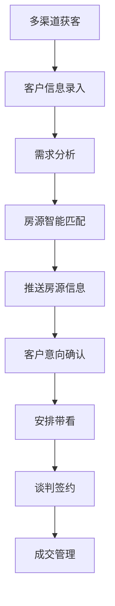
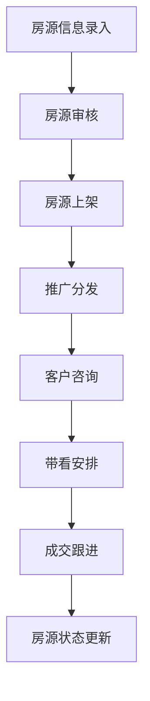
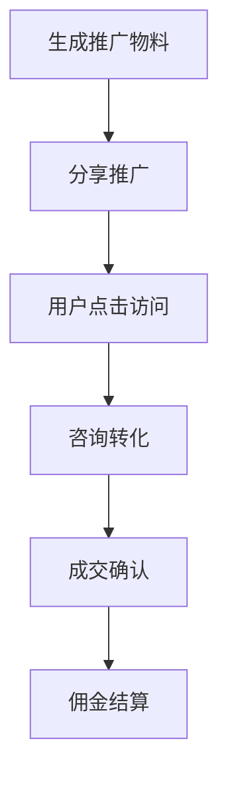

# 工业地产SCRM系统需求梳理文档

## 项目概述

本项目是一个集客户关系管理（CRM）、厂房盘源管理（SCRM）和营销裂变于一体的综合性工业地产租售招商平台解决方案。

### 核心价值定位
- **专业的工业地产租售招商平台**
- **客户关系管理系统**
- **房源资产管理系统**  
- **营销裂变获客系统**

## 功能需求分析

### 一、客户档案与跟进模块（CRM系统）

#### 1.1 客户信息池管理
**核心功能：**
- 客户基本信息录入与管理
- 客户档案标准化存储

**详细需求：**
- 公司名称、联系人信息
- 需求面积范围
- 预算区间
- 所属行业分类
- 联系方式（电话、微信、邮箱）
- 地理位置偏好

#### 1.2 客户来源标签系统
**核心功能：**
- 多渠道来源追踪
- 渠道效果分析

**渠道分类：**
- 抖音推广
- 老客户介绍
- 线下拜访
- 公众号引流
- 视频号推广
- 朋友圈广告
- 其他自定义渠道

#### 1.3 跟进记录与提醒系统
**核心功能：**
- 沟通记录详情管理
- 智能提醒系统

**功能要点：**
- 每次沟通内容记录
- 下次跟进时间设置
- 系统自动提醒功能
- 重要客户标记
- 跟进历史追溯

#### 1.4 客户需求智能匹配
**核心功能：**
- 需求与房源智能匹配
- 推荐算法优化

**匹配维度：**
- 面积需求
- 区域偏好
- 层高要求
- 承重需求
- 价格预算
- 其他特殊要求

#### 1.5 客户状态生命周期管理
**状态分类：**
- 初步意向
- 带看中
- 谈判中
- 已成交
- 已流失

**管理功能：**
- 状态流转记录
- 成交概率评估
- 客户价值分析

### 二、房源管理与分享模块（核心资产）

#### 2.1 标准化房源档案系统
**基础信息：**
- 地址位置
- 建筑面积
- 租售价格
- 高清照片集
- 房源视频

**工业地产专业信息：**
- 土地使用性质
- 房产证情况
- 层高参数
- 承重能力
- 消防等级
- 配电容量
- 排污能力
- 园区配套设施
- 交通优势分析

#### 2.2 房源状态管理系统
**状态分类：**
- 空置可租/售
- 带看预约中
- 谈判中
- 已租/售
- 暂停推广

**功能要点：**
- 状态实时更新
- 业务冲突避免
- 状态变更记录

#### 2.3 沉浸式看房体验
**技术实现：**
- 360°全景看房
- 高清视频看房
- VR虚拟现实体验
- 无人机航拍视频

**业务价值：**
- 解决异地看房痛点
- 提升看房效率
- 降低线下成本

#### 2.4 智能海报与链接生成系统
**海报生成功能：**
- 房源核心信息自动提取
- 二维码自动生成
- 美观海报模板设计
- 一键分享朋友圈/社群

**H5链接生成功能：**
- 独立房源展示页面
- 完整房源信息展示
- 看房视频嵌入
- 地图位置集成
- 联系方式展示
- 微信内无缝传播

#### 2.5 数据洞察与分析系统
**追踪指标：**
- 海报浏览量
- 链接点击量
- 页面停留时间
- 咨询转化量
- 分享传播量

**分析维度：**
- 房源受关注程度
- 推广效果评估
- 用户行为分析
- 渠道效果对比

### 三、新媒体推广与客户裂变模块（获客增长）

#### 3.1 分销与佣金体系（裂变核心）
**分销对象：**
- 已成交客户
- 外部经纪人
- 合作伙伴
- 意见领袖

**佣金机制：**
- 成交后自动计算佣金
- 系统自动分佣
- 佣金等级设定
- 提现管理系统

**专属推广码系统：**
- 个人专属二维码生成
- 推广来源精准追踪
- 佣金自动归属
- 推广效果统计

#### 3.2 营销活动插件系统
**优惠券系统：**
- "推荐有礼"活动
- "限时折扣"促销
- 新客户专享优惠
- 节日特色活动

**拼团购功能：**
- 大面积厂房拼团模式
- 多企业联合租赁
- 团购优惠机制
- 拼团进度展示

#### 3.3 全媒体平台打通
**微信生态集成：**
- 公众号文章嵌入
- 视频号主页集成
- 小程序无缝跳转
- 微信群推广工具

**流量闭环构建：**
- 内容营销引导
- 多触点用户接触
- 转化路径优化

#### 3.4 精准广告投放对接
**广告平台集成：**
- 微信朋友圈广告
- 抖音信息流广告
- 百度竞价推广
- 其他主流广告平台

**投放策略：**
- 精准人群定位
- 地域定向投放
- 行业标签定向
- 再营销策略

## 技术架构需求

### 平台形态
- **微信小程序**（主要载体）
- **H5响应式页面**（传播载体）
- **后台管理系统**（运营管理）

### 核心技术要求
- 高并发访问支持
- 大容量存储能力
- 实时数据同步
- 多媒体处理能力
- 精准推荐算法

### 数据安全要求
- 客户信息加密存储
- 访问权限控制
- 操作日志记录
- 数据备份机制

## 用户角色分析

### 主要用户角色
1. **平台管理员**：系统管理、数据分析
2. **业务经理**：客户管理、房源管理
3. **销售人员**：客户跟进、带看服务
4. **推广合伙人**：分销推广、佣金获取
5. **终端客户**：浏览房源、在线咨询

### 权限体系设计
- 角色权限矩阵
- 数据访问控制
- 功能使用限制
- 敏感操作审核

## 业务流程设计

### 客户获取流程

### 房源管理流程

### 裂变推广流程

## 关键成功指标（KPI）

### 业务指标
- 客户转化率
- 房源成交率
- 平均成交周期
- 客户满意度
- 复购率

### 推广指标
- 分享传播量
- 裂变系数
- 获客成本
- 渠道ROI
- 用户留存率

### 运营指标
- 日活跃用户数
- 月活跃用户数
- 用户使用时长
- 功能使用率
- 系统稳定性

## 项目实施建议

### 开发优先级
1. **第一阶段**：CRM基础功能 + 房源管理核心功能
2. **第二阶段**：智能匹配 + 海报链接生成
3. **第三阶段**：裂变推广 + 数据分析
4. **第四阶段**：高级功能 + 平台集成

### 技术选型建议
- **前端**：微信小程序原生开发 + H5响应式
- **后端**：Node.js/Python + 云服务
- **数据库**：MySQL + Redis缓存
- **存储**：云端对象存储
- **推送**：微信模板消息 + 短信通知

## 风险评估与应对

### 技术风险
- 大文件上传处理
- 高并发访问优化
- 数据安全防护

### 业务风险
- 用户接受度
- 竞品冲击
- 政策合规性

### 应对策略
- 分阶段开发验证
- 用户反馈快速迭代
- 合规性提前规划