# 工业地产SCRM系统集成开发设计

## 1. 系统概述

### 1.1 系统定位
工业地产SCRM（Social Customer Relationship Management）系统是一个集客户关系管理、厂房盘源管理和营销裂变于一体的综合性解决方案，专为工业地产租售招商而设计的专业平台。

### 1.2 核心价值
- **智能化客户管理**：全生命周期客户管理，精准需求匹配
- **标准化房源管理**：工业厂房专业档案管理，360°全景展示
- **社交化营销推广**：分销裂变体系，多渠道获客增长
- **数字化业务流程**：从获客到成交的全链路数字化管理

### 1.3 技术架构选型
- **前端**：微信小程序 + H5移动端
- **后端**：Node.js/Java Spring Boot + 微服务架构
- **数据库**：MySQL + Redis + MongoDB（媒体文件）
- **存储**：阿里云OSS/腾讯云COS
- **推送**：微信模板消息 + 短信通知

## 2. 系统架构设计

### 2.1 整体架构图

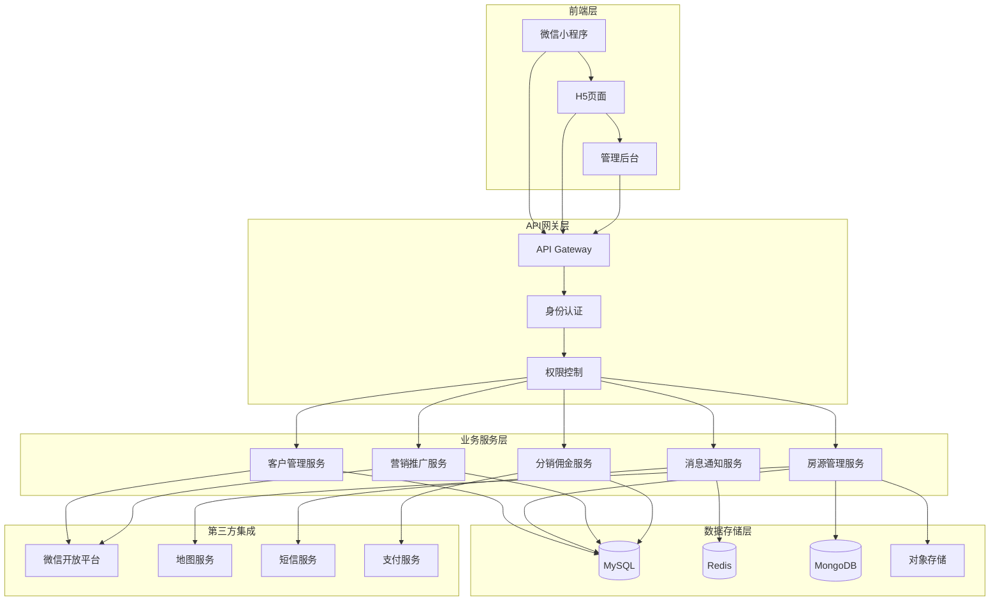

### 2.2 微服务架构设计

| 服务名称 | 职责范围 | 技术栈 |
|---------|---------|-------|
| 用户认证服务 | 微信登录、权限管理、JWT令牌 | Node.js + Redis |
| 客户管理服务 | CRM功能、客户档案、跟进记录 | Java Spring Boot + MySQL |
| 房源管理服务 | 房源档案、状态管理、媒体处理 | Node.js + MongoDB + OSS |
| 营销推广服务 | 海报生成、链接分享、数据统计 | Python + Redis |
| 分销佣金服务 | 推广码生成、佣金计算、结算 | Java + MySQL |
| 消息通知服务 | 模板消息、短信推送、提醒 | Node.js + Redis |

## 3. 核心功能模块设计

### 3.1 客户档案与跟进（CRM系统）

#### 3.1.1 客户信息池设计

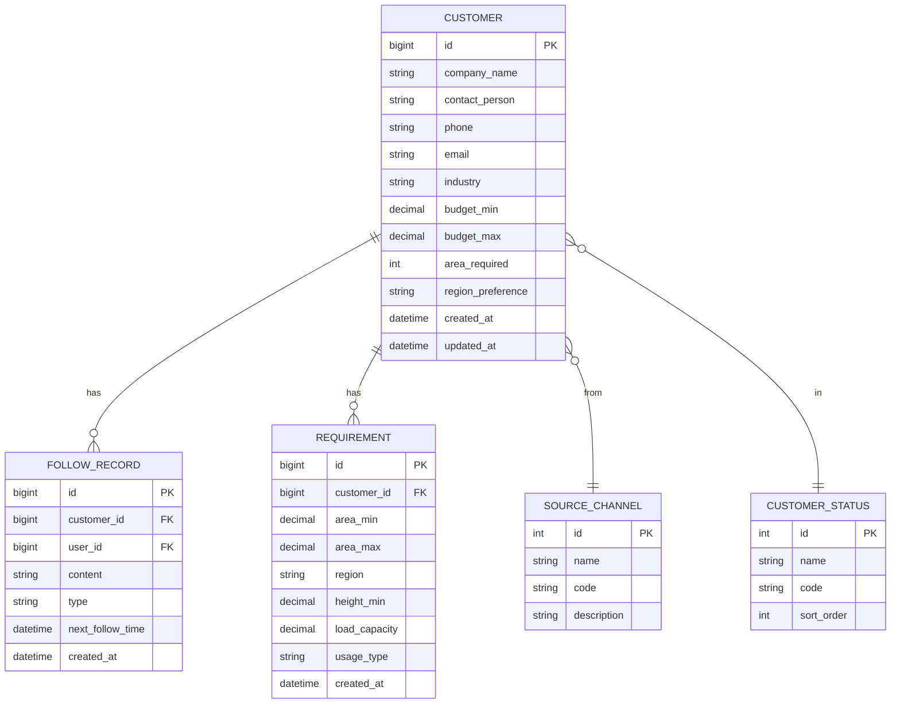

#### 3.1.2 客户状态流转设计

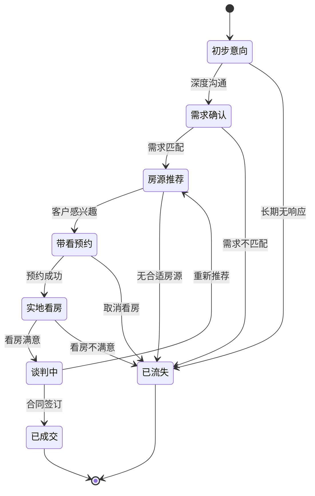

#### 3.1.3 智能需求匹配算法

| 匹配维度 | 权重 | 计算逻辑 |
|---------|------|---------|
| 面积匹配 | 25% | 客户需求面积 ± 20%范围内 |
| 区域匹配 | 20% | 优先级：指定区域>周边区域>同城 |
| 价格匹配 | 20% | 客户预算范围内 |
| 层高要求 | 15% | 满足最低层高要求 |
| 承重要求 | 10% | 满足最低承重要求 |
| 其他需求 | 10% | 消防、配电、交通等 |

### 3.2 房源管理与分享

#### 3.2.1 标准化房源档案

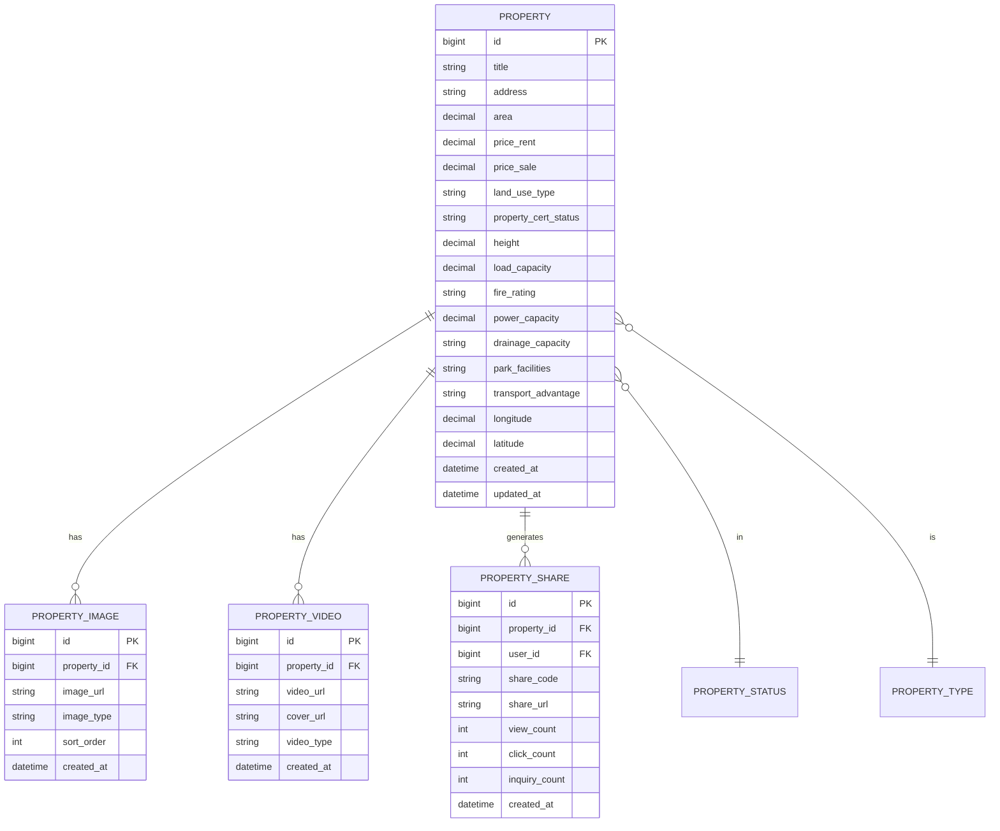

#### 3.2.2 房源状态管理流程

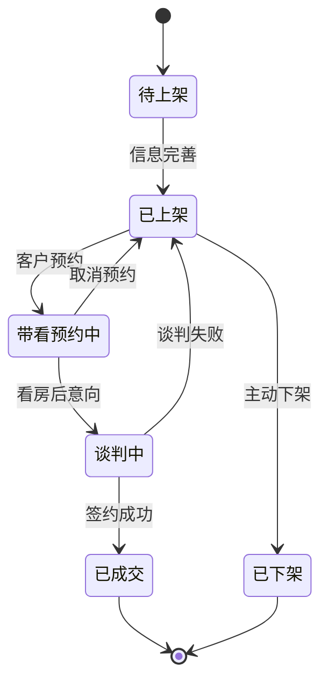

#### 3.2.3 智能海报生成设计

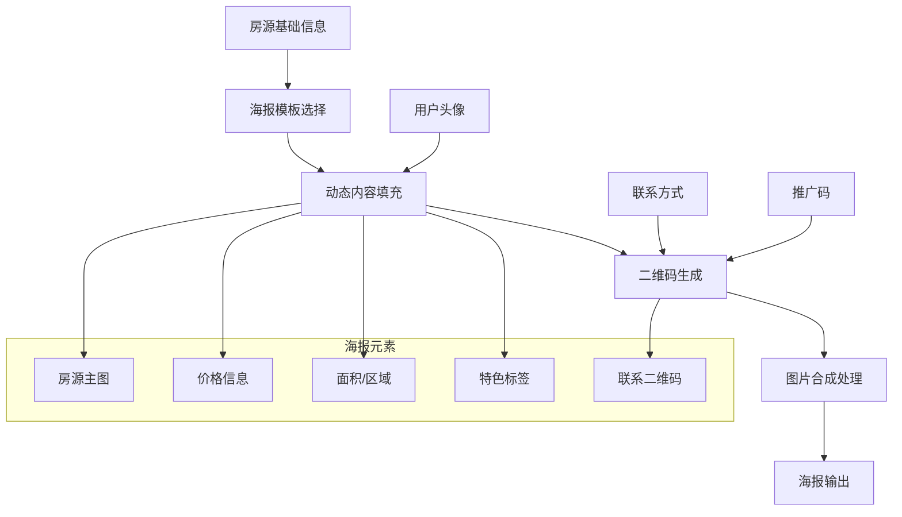

### 3.3 新媒体推广与客户裂变

#### 3.3.1 分销佣金体系设计

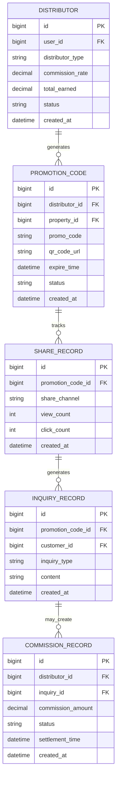

#### 3.3.2 佣金计算规则

| 成交类型 | 基础佣金率 | 分销商等级加成 | 计算公式 |
|---------|-----------|---------------|---------|
| 租赁成交 | 月租金的50% | LV1: +0%, LV2: +10%, LV3: +20% | 月租金 × 50% × (1 + 等级加成) |
| 销售成交 | 成交价的0.5% | LV1: +0%, LV2: +10%, LV3: +20% | 成交价 × 0.5% × (1 + 等级加成) |
| 客户推荐 | 固定奖励 | 有效客户：200元，成交客户：1000元 | 固定金额 |

#### 3.3.3 营销活动设计

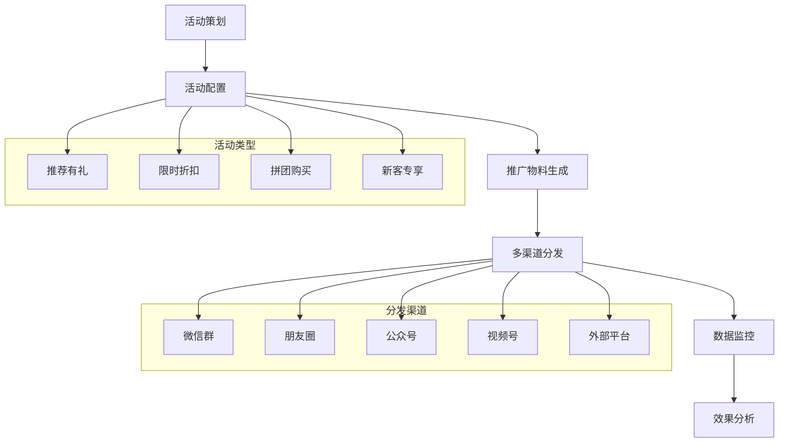

## 4. 技术实现方案

### 4.1 前端技术架构

#### 4.1.1 微信小程序架构

```
src/
├── pages/                  # 页面目录
│   ├── index/             # 首页
│   ├── property/          # 房源相关页面
│   │   ├── list/          # 房源列表
│   │   ├── detail/        # 房源详情
│   │   └── share/         # 房源分享
│   ├── customer/          # 客户管理页面
│   │   ├── list/          # 客户列表
│   │   ├── detail/        # 客户详情
│   │   └── follow/        # 跟进记录
│   ├── marketing/         # 营销推广页面
│   │   ├── promotion/     # 推广中心
│   │   ├── commission/    # 佣金管理
│   │   └── activity/      # 活动中心
│   └── user/              # 个人中心
├── components/            # 组件目录
│   ├── property-card/     # 房源卡片
│   ├── customer-card/     # 客户卡片
│   ├── follow-item/       # 跟进记录项
│   └── share-poster/      # 分享海报
├── utils/                 # 工具函数
│   ├── request.js         # 网络请求
│   ├── auth.js            # 认证相关
│   ├── storage.js         # 本地存储
│   └── share.js           # 分享功能
├── store/                 # 状态管理
│   ├── user.js            # 用户状态
│   ├── property.js        # 房源状态
│   └── customer.js        # 客户状态
└── app.js                 # 应用入口
```

#### 4.1.2 H5页面设计

| 页面类型 | 功能描述 | 技术方案 |
|---------|---------|---------|
| 房源展示页 | 房源详情展示、360°看房、视频播放 | Vue3 + Element Plus |
| 分享落地页 | 推广码访问落地页、表单收集 | 响应式设计 + 微信JS-SDK |
| 活动页面 | 营销活动展示、参与表单 | 动画效果 + 移动端优化 |

### 4.2 后端技术架构

#### 4.2.1 API设计规范

```yaml
# 客户管理相关API
GET /api/customers                    # 获取客户列表
POST /api/customers                   # 创建客户
GET /api/customers/{id}               # 获取客户详情
PUT /api/customers/{id}               # 更新客户信息
DELETE /api/customers/{id}            # 删除客户

POST /api/customers/{id}/follow       # 添加跟进记录
GET /api/customers/{id}/follow        # 获取跟进记录
PUT /api/customers/{id}/status        # 更新客户状态

# 房源管理相关API
GET /api/properties                   # 获取房源列表
POST /api/properties                  # 创建房源
GET /api/properties/{id}              # 获取房源详情
PUT /api/properties/{id}              # 更新房源信息
DELETE /api/properties/{id}           # 删除房源

POST /api/properties/{id}/images      # 上传房源图片
POST /api/properties/{id}/videos      # 上传房源视频
POST /api/properties/{id}/share       # 生成分享链接

# 营销推广相关API
POST /api/promotion/codes             # 生成推广码
GET /api/promotion/statistics         # 获取推广统计
POST /api/promotion/posters           # 生成海报

GET /api/commission/records           # 获取佣金记录
POST /api/commission/withdraw         # 申请提现
```

#### 4.2.2 数据库设计优化

```sql
-- 客户表索引优化
CREATE INDEX idx_customer_phone ON customers(phone);
CREATE INDEX idx_customer_status ON customers(status);
CREATE INDEX idx_customer_source ON customers(source_channel);
CREATE INDEX idx_customer_created ON customers(created_at);

-- 房源表索引优化
CREATE INDEX idx_property_area ON properties(area);
CREATE INDEX idx_property_price_rent ON properties(price_rent);
CREATE INDEX idx_property_region ON properties(region);
CREATE INDEX idx_property_status ON properties(status);
CREATE INDEX idx_property_location ON properties(longitude, latitude);

-- 分享记录表索引优化
CREATE INDEX idx_share_code ON property_shares(share_code);
CREATE INDEX idx_share_property ON property_shares(property_id);
CREATE INDEX idx_share_user ON property_shares(user_id);
CREATE INDEX idx_share_created ON property_shares(created_at);
```

### 4.3 第三方集成方案

#### 4.3.1 微信生态集成

| 集成功能 | 接口说明 | 实现方案 |
|---------|---------|---------|
| 微信登录 | wx.login + code2Session | 小程序授权登录 |
| 模板消息 | 订阅消息推送 | 跟进提醒、成交通知 |
| 分享功能 | wx.shareAppMessage | 房源分享、活动推广 |
| 支付功能 | 微信支付 | 佣金提现、活动支付 |
| 地图服务 | 腾讯地图API | 房源定位、距离计算 |

#### 4.3.2 营销平台对接

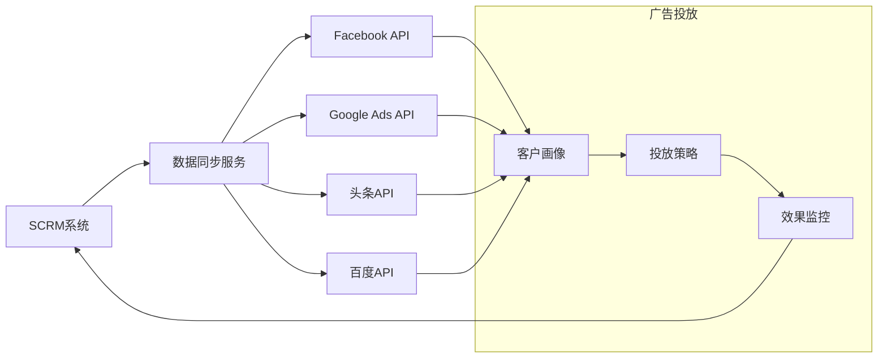

## 5. 数据流程设计

### 5.1 客户获取到成交流程

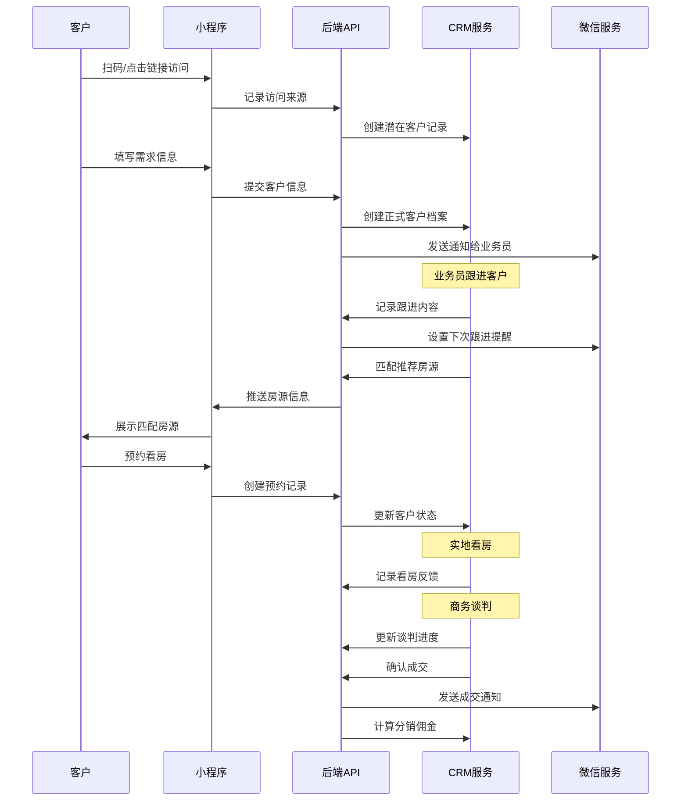

### 5.2 房源分享推广流程

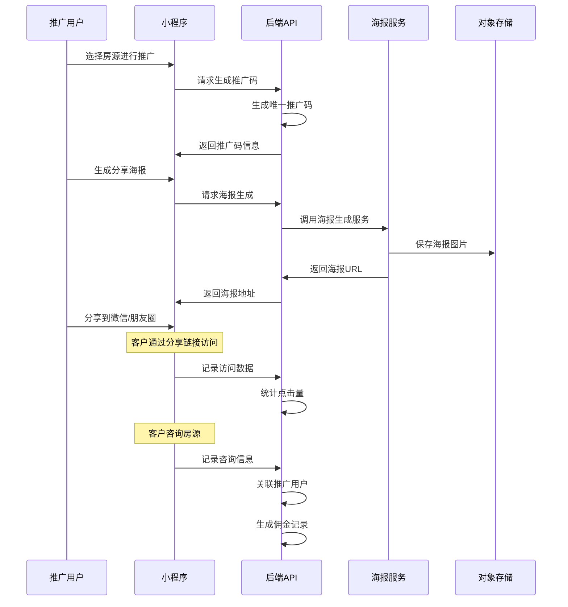

## 6. 系统安全设计

### 6.1 数据安全保护

| 安全层级 | 保护措施 | 实现方案 |
|---------|---------|---------|
| 传输安全 | HTTPS加密 | SSL证书，强制HTTPS |
| 接口安全 | JWT认证 | Token过期机制，刷新策略 |
| 数据加密 | 敏感信息加密 | AES256加密手机号、身份证 |
| 访问控制 | 权限管理 | RBAC角色权限控制 |
| 审计日志 | 操作记录 | 关键操作日志记录 |

### 6.2 业务风控设计

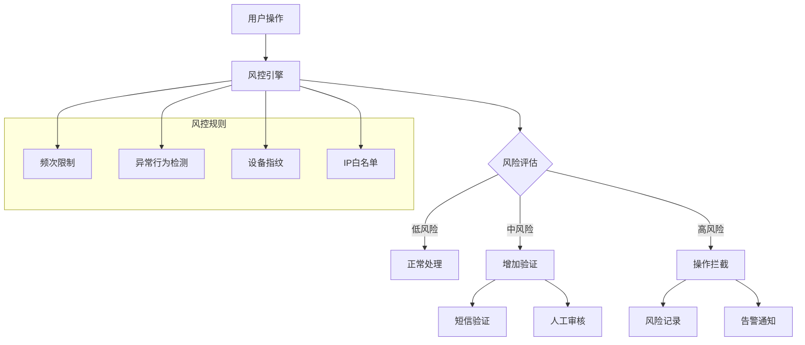

## 7. 性能优化方案

### 7.1 前端性能优化

| 优化项目 | 优化策略 | 预期效果 |
|---------|---------|---------|
| 图片加载 | 懒加载 + WebP格式 + CDN | 减少50%加载时间 |
| 代码分包 | 小程序分包加载 | 首屏时间 < 2s |
| 缓存策略 | 本地缓存 + 服务端缓存 | 减少70%重复请求 |
| 网络优化 | 请求合并 + 数据预加载 | 提升30%响应速度 |

### 7.2 后端性能优化

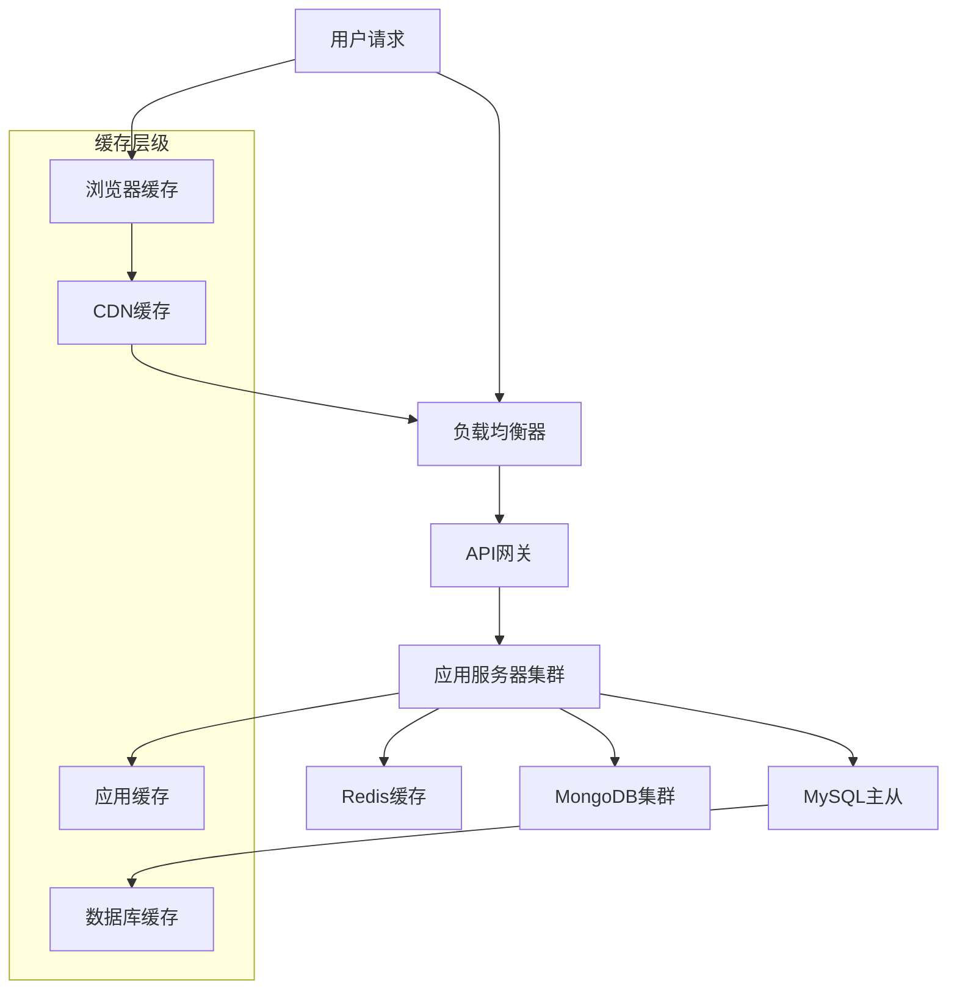

### 7.3 数据库优化策略

| 优化类型 | 具体措施 | 性能提升 |
|---------|---------|---------|
| 查询优化 | 索引优化、SQL优化 | 查询速度提升80% |
| 读写分离 | 主从复制、读写分离 | 并发能力提升3倍 |
| 分库分表 | 按业务垂直拆分 | 支持更大数据量 |
| 缓存策略 | Redis多级缓存 | 响应时间 < 100ms |

## 8. 测试策略

### 8.1 测试金字塔

```mermaid
pyramid
    title 测试金字塔
    
    "E2E测试" : 10
    "集成测试" : 30
    "单元测试" : 60
```

### 8.2 测试用例设计

#### 8.2.1 功能测试用例

| 测试模块 | 测试场景 | 预期结果 |
|---------|---------|---------|
| 用户登录 | 微信授权登录 | 成功获取用户信息 |
| 客户管理 | 创建客户档案 | 信息正确保存 |
| 房源管理 | 上传房源图片 | 图片正常显示 |
| 分享推广 | 生成分享海报 | 海报内容完整 |
| 佣金结算 | 计算推广佣金 | 金额计算准确 |

#### 8.2.2 性能测试用例

| 测试项目 | 测试指标 | 目标值 |
|---------|---------|-------|
| 页面加载 | 首屏加载时间 | < 2秒 |
| API响应 | 接口响应时间 | < 500ms |
| 并发处理 | 支持并发用户数 | > 1000 |
| 数据库 | 查询响应时间 | < 100ms |

## 9. 运维监控方案

### 9.1 监控体系设计

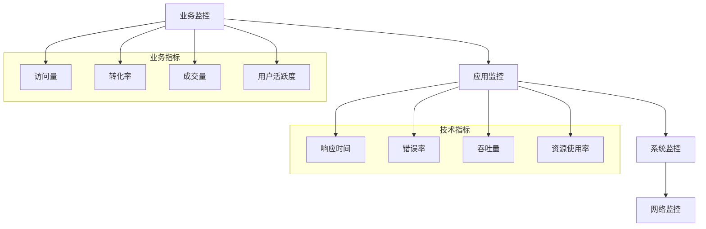

### 9.2 告警策略

| 告警级别 | 触发条件 | 处理方式 |
|---------|---------|---------|
| 严重告警 | 系统不可用、数据丢失 | 立即电话通知 + 短信 |
| 重要告警 | 错误率>5%、响应时间>3s | 微信群通知 + 邮件 |
| 一般告警 | 资源使用率>80% | 邮件通知 |
| 提醒告警 | 业务指标异常 | 日报统计 |

## 10. 部署架构

### 10.1 生产环境部署

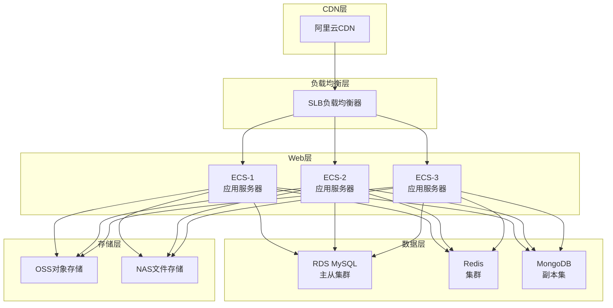

### 10.2 容器化部署

```yaml
version: '3.8'
services:
  # API Gateway
  api-gateway:
    image: nginx:alpine
    ports:
      - "80:80"
      - "443:443"
    volumes:
      - ./nginx.conf:/etc/nginx/nginx.conf
    depends_on:
      - customer-service
      - property-service
  
  # 客户管理服务
  customer-service:
    build: ./services/customer
    environment:
      - DB_HOST=mysql
      - REDIS_HOST=redis
    depends_on:
      - mysql
      - redis
  
  # 房源管理服务
  property-service:
    build: ./services/property
    environment:
      - DB_HOST=mongodb
      - OSS_ENDPOINT=oss.aliyuncs.com
    depends_on:
      - mongodb
  
  # 数据库
  mysql:
    image: mysql:8.0
    environment:
      MYSQL_ROOT_PASSWORD: ${MYSQL_ROOT_PASSWORD}
      MYSQL_DATABASE: scrm_db
    volumes:
      - mysql_data:/var/lib/mysql
  
  redis:
    image: redis:alpine
    command: redis-server --appendonly yes
    volumes:
      - redis_data:/data
  
  mongodb:
    image: mongo:5.0
    volumes:
      - mongodb_data:/data/db

volumes:
  mysql_data:
  redis_data:
  mongodb_data:
```

### 10.3 CI/CD流水线

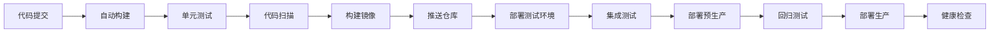